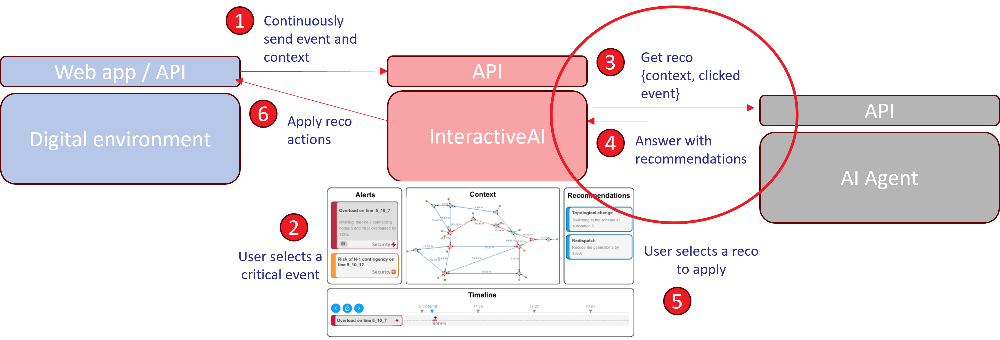

# AI Agent Integration

## Overview

InteractiveAI is a platform that bridges AI agents with digital environments (simulators) through a web interface. It provides operators with real-time event monitoring, contextual recommendations, and the ability to apply AI-generated actions directly to their environment.

This documentation uses the PowerGrid domain as an example to illustrate how to integrate an AI agent (ExpertRL Agent) with InteractiveAI.

In our enviroment diagram, we are refering to steps 3 and 4.


*Figure 1: InteractiveAI general workflow*

---

## AI Agent Repository Structure

The agent repository should include an `app` folder and a `Dockerfile` at the root. The following structure is used by ExpertAgent ([reference implementation](https://github.com/ainetus/T2.1_deep_expert/tree/docker)):

```
agent-repo/
├── Dockerfile
├── requirements_docker.txt
├── setup.py
└── app/
    ├── __init__.py       # Runs the API
    └── main.py           # FastAPI app definition
```

### `Dockerfile` (minimal illustration)

```dockerfile
FROM python:3.12-slim

WORKDIR /app

# Install git
# Create a directory for environment

# Install Agent package dependencies
COPY requirements_docker.txt .
RUN pip install --no-cache-dir -r requirements_docker.txt

# Copy API + agent package
COPY app ./app/

# Install the project using setup.py at the root
RUN pip install .

# Expose port
EXPOSE 8000

# Run server
CMD ["uvicorn", "app.main:app", "--host", "0.0.0.0", "--port", "8000"]
```

### `app/main.py`

```python
from fastapi import FastAPI

agent = ExpertAgentRL(kwargs)
app = FastAPI()

@app.post("/api/v1/recommendation")
def get_recommendation(request: RecommendationRequest):
    # Convert incoming data to the observation format your agent expects
    observation = {
        "event": request.event,
        "context": request.context,
    }
    # Get recommendation from RL agent
    obs.from_json(observation.get("context", {}).get("observation"))
    action = agent.act(obs, reward=None, done=False)
    result = get_parade_info(action, obs)
    if result is not list:
        result = [result]
    return result
```

For a complete implementation of `main.py`, see [here](https://github.com/ainetus/T2.1_deep_expert/blob/docker/app/main.py).  
The transformation of an action to the required format is handled by `get_parade_info(act, obs)`, available [here](https://github.com/ainetus/T2.1_deep_expert/blob/docker/app/main.py#L100).

---

## Running and Testing the Agent Locally

### 1. Build the Docker image

```bash
docker build -t expert-agent-api .
```

### 2. Run the container

```bash
docker run -p 8000:8000 expert-agent-api
```

### 3. Test the recommendation endpoint

Send a POST request using a context JSON file:

```bash
curl -X POST http://localhost:8000/api/v1/recommendation \
  -H "Content-Type: application/json" \
  --data @rte_recommendation.json
```

The `rte_recommendation.json` context example is available [here](https://github.com/ainetus/T2.1_deep_expert/blob/docker/app/rte_recommendation.json). The expected output is a list of recommendations in dictionary format:

```json
[
  {
    "title": "Topological recommendation: Schematic acquisition at substation 11",
    "description": "Assign bus 1 to line (extremity) id 11, Assign bus 1 to line (origin) id 13, Assign bus 1 to load id 12",
    "use_case": "PowerGrid",
    "agent_type": 2,
    "actions": [
      {
        "_set_line_status": [0, 0, 0, "..."],
        "_switch_line_status": [false, false, "..."],
        "_set_topo_vect": [0, 0, 1, 1, 1, "..."],
        "_change_bus_vect": [false, false, "..."],
        "_redispatch": [0.0, 0.0, "..."],
        "_storage_power": [],
        "_curtail": [-1.0, -1.0, "..."],
        "_raise_alarm": [false, false, false],
        "_raise_alert": []
      }
    ],
    "kpis": {
      "type_of_the_reco": "Topological",
      "efficiency_of_the_reco": 0.8976841568946838
    }
  }
]
```

> A helper function `get_parade_info(act, obs)` is provided — it takes an action and the corresponding observation and outputs this dictionary format per action.

---

## Complete Dockerfile

```dockerfile
FROM python:3.12-slim

WORKDIR /app

# Install git
RUN apt-get update && apt-get install -y git && apt-get clean

# Create a directory for environment
RUN mkdir -p /home/root/data_grid2op/
RUN git clone https://github.com/AI4REALNET/grid2op-scenario.git /tmp/grid2op-scenario
RUN mkdir -p /root/data_grid2op
RUN cp -r /tmp/grid2op-scenario/ai4realnet_small /root/data_grid2op/ai4realnet_small
RUN rm -rf /tmp/grid2op-scenario

# Python dependencies
COPY requirements_docker.txt .
RUN pip install --no-cache-dir -r requirements_docker.txt

# Copy API + agent package
COPY app ./app/
COPY ExpertAgent ./ExpertAgent/
COPY setup.py .

# Install the project using setup.py at the root
RUN pip install .

# Expose port
EXPOSE 8000

# Run server
CMD ["uvicorn", "app.main:app", "--host", "0.0.0.0", "--port", "8000"]
```

For the full Dockerfile example, see [here](https://github.com/ainetus/T2.1_deep_expert/blob/docker/Dockerfile).
